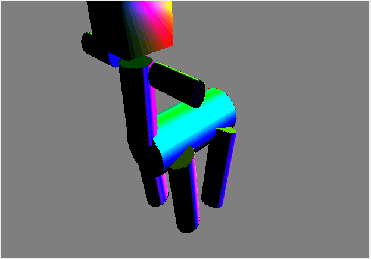
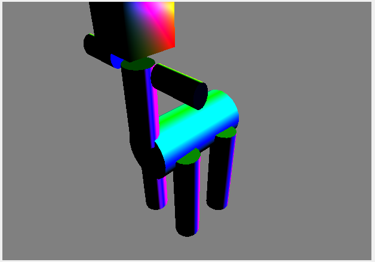
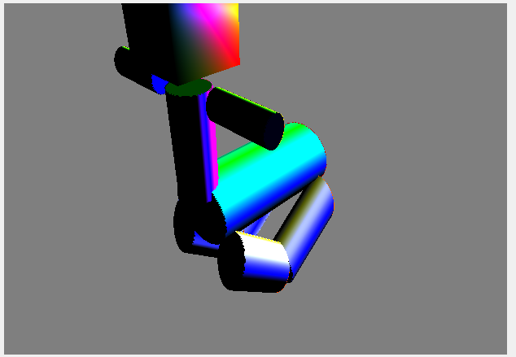

# CIS560_HW4

## ReadMe:
Q1:(7 pts) In C++, what is a virtual function and how does it relate to object polymorphism? Say I have a class Base and a class Derived that inherits from Base. Both classes implement a non-virtual function called func(). If func() is invoked by dereferencing a pointer to a Base that actuallypoints to an instance of Derived, how does the compiler know which implementation of func() to call?

A: Virtual Functions can be defined by both the parent class and the inherited classes. If we need to describe an object that has many sub-divisions which acts differently, then we will need to use virtual functions. (eg. class Animal, class Cat: public Animal, class Dog: public Animal, and virtual function talk() ). 

In this case, the function in the Derived class's func(). 

Q2:(4 pts) The ShaderProgram class has several member variables of type int, such as attrPos and unifModel. What do these variables represent? How are they given values in the first place?

A: These are not the actual data of vertices' positions or colors, these are the positions of the vertex data in the buffer. These attributes are given values from the index of vertices we created in the scene folder. 

Q3:(4 pts) In the OpenGL Shading Language (GLSL), what is a uniform variable? What is an "in" variable? What is an "out" variable? How does a vertex shader pass data to a fragment shader?

A uniform variable is like a constant variable in C language, it does not change during the procedure, so we could use it for some parameters that will not change, for example, a projection matrix. 

We can consider the "in" and "out" like the input and output in an electronic system, the only difference is that they are parallel  processed rather than one by one. In the vertex shader system and the fragment shader system, there both exists in and out variables. So we could use the "out" variables in the vertex shader to pass data to the fragment shader. 

## Helper Log: 
/////////////////////
## HW4 Scene Graph v1.0
/////////////////////

In this program, I added cube.h and cube.cpp into the scene folder. These two files defined a cube. 

I mainly modified the mygl.h and mygl.cpp. 

A new class called SceneGraph is added, which defined a node in the SceneGraph. 

In this homework, I tried to make a centaur, or something looks like that. 

You can see what it looks like if you're not familiar with it. 

https://en.wikipedia.org/wiki/Centaur

My scene graph starts from the horse body of the centaur, since it is the biggest part. 

Since I failed to make a QTree, I will show the node structure here. 

ROOT: 			     Horse Body
			            /        \      \      \     \
Child: 		       Human Body, leg1, leg2, leg3, leg4
		                  /       |    \
SubChild:	          Head,   arm1,   arm2

If you like it, you can modify the shapes in the MyGL::initializeGL() in mygl.cpp

In addition, to test the shading, I made the centaur running during the time using a rotate( sin(time) );

I wish it won't scare you when running. 

//////////////////

Troubles: 

1-Where's the messege loop in QT? I can not find it, and it's not comfortable for me, since there's a messege loop in MFC. 

2-I used the Intel Graphic Card and the Nvidia Graphic Card to render. I noticed there's some difference. I have put the screenshot in this folder. I wonder if that's my fault or the hardware's fault. 

# Intel Graphic Card: 

 

# Nvidia Graphic Card:

 

